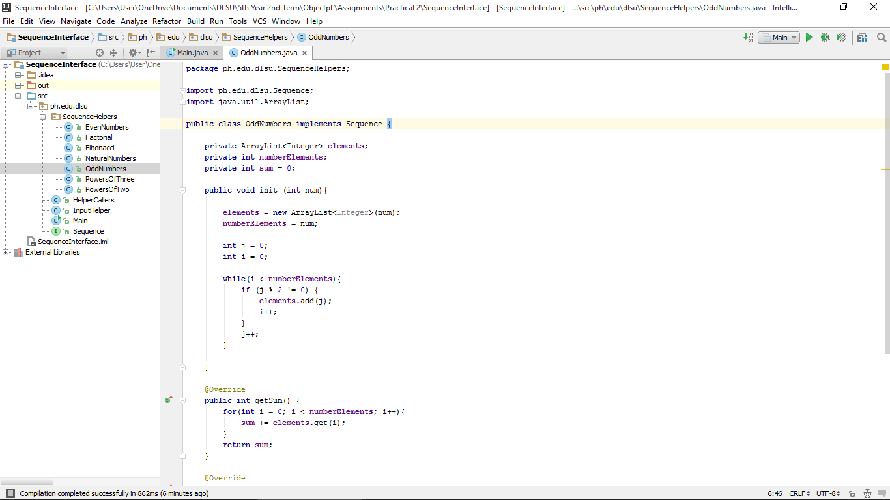

#SequenceInterface

Practical 2

#ScreenShots
###Main

###Output

###SequenceInterface

###InputHelper

###HelperCallers

###NaturalNumbers

###EvenNumbers

###OddNumbers

###Fibonacci

###Factorial

###PowerOfTwo

###PowersOfThree

#Codes
###Main
~~~
package ph.edu.dlsu;

public class Main {

    public static void main(String[] args) {
        String input = InputHelper.getInput("Enter number of elements you want to print and add: ");
        int number = Integer.parseInt(input);

        System.out.println("");
        HelperCallers.doNatural(number);
        System.out.println("");
        HelperCallers.doFibonacci(number);
        System.out.println("");
        HelperCallers.doEven(number);
        System.out.println("");
        HelperCallers.doOdd(number);
        System.out.println("");
        HelperCallers.doPowerTwo(number);
        System.out.println("");
        HelperCallers.doPowerThree(number);
        System.out.println("");
        HelperCallers.doFactorial(number);

    }

}
~~~

###SequenceInterface
~~~
package ph.edu.dlsu;

public interface Sequence {

    public int getSum();
    public void printElements();

}
~~~

###InputHelper
~~~
package ph.edu.dlsu;

import java.io.BufferedReader;
import java.io.InputStreamReader;

public class InputHelper {

    static String getInput(String prompt) {
        BufferedReader stdin = new BufferedReader(
                new InputStreamReader(System.in));

        System.out.print(prompt);
        System.out.flush();

        try {
            return stdin.readLine();
        } catch (Exception e) {
            return "Error: " + e.getMessage();
        }
    }

}
~~~

###HelperCallers
~~~
package ph.edu.dlsu;

import ph.edu.dlsu.SequenceHelpers.*;

public class HelperCallers {

    static void doPowerThree(int number) {
        PowersOfThree powersOfThree = new PowersOfThree();
        powersOfThree.init(number);
        System.out.print(number + " consecutive POWERS OF THREE numbers: ");
        powersOfThree.printElements();
        System.out.println("\nSum of " + number + " consecutive POWERS OF THREE numbers: " + powersOfThree.getSum());
    }

    static void doPowerTwo(int number) {
        PowersOfTwo powersOfTwo = new PowersOfTwo();
        powersOfTwo.init(number);
        System.out.print(number + " consecutive POWERS OF TWO numbers: ");
        powersOfTwo.printElements();
        System.out.println("\nSum of " + number + " consecutive POWERS OF TWO numbers: " + powersOfTwo.getSum());
    }

    static void doFactorial(int number) {
        Factorial factorial = new Factorial();
        factorial.init(number);
        System.out.print(number + " consecutive FACTORIAL numbers: ");
        factorial.printElements();
        System.out.println("\nSum of " + number + " consecutive FACTORIAL numbers: " + factorial.getSum());
    }

    static void doFibonacci(int number) {
        Fibonacci fibonacci = new Fibonacci();
        fibonacci.init(number);
        System.out.print(number + " consecutive FIBONACCI numbers: ");
        fibonacci.printElements();
        System.out.println("\nSum of " + number + " consecutive FIBONACCI numbers: " + fibonacci.getSum());
    }

    static void doOdd(int number) {
        OddNumbers oddNumbers = new OddNumbers();
        oddNumbers.init(number);
        System.out.print(number + " consecutive ODD numbers: ");
        oddNumbers.printElements();
        System.out.println("\nSum of " + number + " consecutive ODD numbers: " + oddNumbers.getSum());
    }

    static void doEven(int number) {
        EvenNumbers evenNumbers = new EvenNumbers();
        evenNumbers.init(number);
        System.out.print(number + " consecutive EVEN numbers: ");
        evenNumbers.printElements();
        System.out.println("\nSum of " + number + " consecutive EVEN numbers: " + evenNumbers.getSum());
    }

    static void doNatural(int number) {
        NaturalNumbers naturalNumbers = new NaturalNumbers();
        naturalNumbers.init(number);
        System.out.print(number + " consecutive NATURAL numbers: ");
        naturalNumbers.printElements();
        System.out.println("\nSum of " + number + " consecutive NATURAL numbers: " + naturalNumbers.getSum());
    }

}
~~~

###NaturalNumbers
~~~
package ph.edu.dlsu.SequenceHelpers;

import ph.edu.dlsu.Sequence;
import java.util.ArrayList;

public class NaturalNumbers implements Sequence {

    private ArrayList<Integer> elements;
    private int numberElements;
    private int sum = 0;

    public void init (int num){

        elements = new ArrayList<Integer>(num);
        numberElements = num;

        for(int i = 0; i < numberElements; i++){
                elements.add(i);
        }

    }

    @Override
    public int getSum() {
        for(int i = 0; i < numberElements; i++){
            sum += elements.get(i);
        }
        return sum;
    }

    @Override
    public void printElements() {
        System.out.print("{");

        for(int i = 0; i < numberElements; i++){
            System.out.print(elements.get(i));
                if(i < numberElements-1)
                    System.out.print(", ");
        }

        System.out.print("}");
    }
}
~~~

###EvenNumbers
~~~
package ph.edu.dlsu.SequenceHelpers;

import ph.edu.dlsu.Sequence;
import java.util.ArrayList;

public class EvenNumbers implements Sequence {

    private ArrayList<Integer> elements;
    private int numberElements;
    private int sum = 0;

    public void init (int num){

        elements = new ArrayList<Integer>(num);
        numberElements = num;

        int j = 0;
        int i = 0;

        while(i < numberElements){
            if (j % 2 == 0) {
                elements.add(j);
                i++;
            }
            j++;
        }

    }

    @Override
    public int getSum() {
        for(int i = 0; i < numberElements; i++){
            sum += elements.get(i);
        }
        return sum;
    }

    @Override
    public void printElements() {
        System.out.print("{");

        for(int i = 0; i < numberElements; i++){
            System.out.print(elements.get(i));
            if(i < numberElements-1)
                System.out.print(", ");
        }

        System.out.print("}");
    }
}
~~~

###OddNumbers
~~~
package ph.edu.dlsu.SequenceHelpers;

import ph.edu.dlsu.Sequence;
import java.util.ArrayList;

public class OddNumbers implements Sequence {

    private ArrayList<Integer> elements;
    private int numberElements;
    private int sum = 0;

    public void init (int num){

        elements = new ArrayList<Integer>(num);
        numberElements = num;

        int j = 0;
        int i = 0;

        while(i < numberElements){
            if (j % 2 != 0) {
                elements.add(j);
                i++;
            }
            j++;
        }

    }

    @Override
    public int getSum() {
        for(int i = 0; i < numberElements; i++){
            sum += elements.get(i);
        }
        return sum;
    }

    @Override
    public void printElements() {
        System.out.print("{");

        for(int i = 0; i < numberElements; i++){
            System.out.print(elements.get(i));
            if(i < numberElements-1)
                System.out.print(", ");
        }

        System.out.print("}");
    }
}
~~~

###Fibonacci
~~~
package ph.edu.dlsu.SequenceHelpers;

import ph.edu.dlsu.Sequence;
import java.util.ArrayList;

public class Fibonacci implements Sequence {

    private ArrayList<Integer> elements;
    private int numberElements;
    private int sum = 0;

    public void init (int num){

        elements = new ArrayList<Integer>(num);
        numberElements = num;

        int first = 0;
        int second = 1;

        for(int i = 0; i < numberElements; i++){
            elements.add(first);
            first = first + second;
            second = first - second;
        }

    }

    @Override
    public int getSum() {
        for(int i = 0; i < numberElements; i++){
            sum += elements.get(i);
        }
        return sum;
    }

    @Override
    public void printElements() {
        System.out.print("{");

        for(int i = 0; i < numberElements; i++){
            System.out.print(elements.get(i));
            if(i < numberElements-1)
                System.out.print(", ");
        }

        System.out.print("}");
    }
}
~~~

###Factorial
~~~
package ph.edu.dlsu.SequenceHelpers;

import ph.edu.dlsu.Sequence;
import java.util.ArrayList;

public class Factorial implements Sequence {

    private ArrayList<Integer> elements;
    private int numberElements;
    private int sum = 0;

    public void init (int num) {
        elements = new ArrayList<Integer>(num);
        numberElements = num;

        int result = 0;

        elements.add(1);

        for (int i = 1; i <= numberElements; i++) {
            result = getResult(i);
            elements.add(result);
        }
    }

    private int getResult(int i) {
        if (i == 1)
            return 1;
        else
            return i * getResult(i - 1);
    }

    @Override
    public int getSum() {
        for(int i = 0; i < numberElements; i++){
            sum += elements.get(i);
        }
        return sum;
    }

    @Override
    public void printElements() {
        System.out.print("{");

        for(int i = 0; i < numberElements; i++){
            System.out.print(elements.get(i));
            if(i < numberElements-1)
                System.out.print(", ");
        }

        System.out.print("}");
    }
}
~~~

###PowersOfTwo
~~~
package ph.edu.dlsu.SequenceHelpers;

import ph.edu.dlsu.Sequence;
import java.util.ArrayList;

public class PowersOfTwo implements Sequence {

    private ArrayList<Integer> elements;
    private int numberElements;
    private int sum = 0;

    public void init (int num){

        elements = new ArrayList<Integer>(num);
        numberElements = num;

        double j = 0;
        for(double i = 0; i < numberElements; i++){
            j = Math.pow(2, i);
            elements.add((int) j);
        }

    }

    @Override
    public int getSum() {
        for(int i = 0; i < numberElements; i++){
            sum += elements.get(i);
        }
        return sum;
    }

    @Override
    public void printElements() {
        System.out.print("{");

        for(int i = 0; i < numberElements; i++){
            System.out.print(elements.get(i));
            if(i < numberElements-1)
                System.out.print(", ");
        }

        System.out.print("}");
    }
}
~~~

###PowersOfThree
~~~
package ph.edu.dlsu.SequenceHelpers;

import ph.edu.dlsu.Sequence;
import java.util.ArrayList;

public class PowersOfThree implements Sequence {

    private ArrayList<Integer> elements;
    private int numberElements;
    private int sum = 0;

    public void init (int num){

        elements = new ArrayList<Integer>(num);
        numberElements = num;

        double j = 0;
        for(double i = 0; i < numberElements; i++){
            j = Math.pow(3, i);
            elements.add((int) j);
        }

    }

    @Override
    public int getSum() {
        for(int i = 0; i < numberElements; i++){
            sum += elements.get(i);
        }
        return sum;
    }

    @Override
    public void printElements() {
        System.out.print("{");

        for(int i = 0; i < numberElements; i++){
            System.out.print(elements.get(i));
            if(i < numberElements-1)
                System.out.print(", ");
        }

        System.out.print("}");
    }
}
~~~
